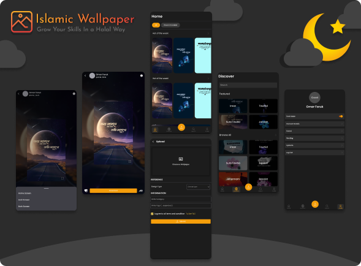

<div id="top"></div>
<!-- PROJECT LOGO -->
<br />

<div align="center" >
  <a href="https://github.com/OmarFaruk-0x01/IslamicWallpaper" >
    
  </a>
</div>
<h3 align="center">
Islamic Wallpaper
</h3>
  <p align="center">
   Islamic Wallpaper is a platform of spreading dawah with mobile screens  
    <br />
    <br />
    <a href="https://github.com/OmarFaruk-0x01/Education-Board-Results/issues">Report Bug</a>
    ·
    <a href="https://github.com/OmarFaruk-0x01/Education-Board-Results/issues">Request Feature</a>
  </p>
</div>
</div>


<!-- TABLE OF CONTENTS -->
<details open >
  <summary style="cursor: pointer;">Table of Contents</summary>
  <ol>
    <li>
      <a href="#about-the-project">About The Project</a>
      <ul>
        <li><a href="#features-with-snapshots">Features with Snapshots</a></li>
        <li><a href="#built-with">Built With</a></li>
      </ul>
    </li>
        <li><a href="#prerequisites">Prerequisites</a></li>
    <li>
      <a href="#installation">Installation</a>
    </li>
    <li>
      <a href="#setup_run">Setup & Run</a>
    </li>
    <li><a href="#roadmap">Roadmap</a></li>
   
  </ol>
</details>


<!-- ABOUT THE PROJECT -->
## About The Project
<div align="center">

</div><br>
Islamic Wallpaper is a wallpaper app inspired by Halal Designs. Here designer can share their designs and spread dawah. The app was made with React Native as a Frontend Technology. People can easily get a dawah wallpaper download in one click.  

<p align="right">(<a href="#top">back to top</a>)</p>

## Features with Snapshots
1. All kinds of Dawah Wallpapers
   <details ><summary>snapshot</summary>

   

   </details>
2. Categorized Wallpapers and Search Ability
   <details ><summary>snapshot</summary>

   
   </details>
3. Upload Own Designed Wallpapers
   <details ><summary>snapshot</summary>
   
   </details>
4. Wallpaper Preview Screen
   <details ><summary>snapshot</summary>
   
   </details>
5. Account Setting Screen
   <details ><summary>snapshot</summary>
   
   </details>
## Built With 
 
* [React Native](https://reactnative.dev/)
* [Native Base UI](https://nativebase.io/) 

<p align="right">(<a href="#top">back to top</a>)</p>


## Prerequisites
There are some prerequisites to run this app and server

* **NPM**
  
  Follow the instruction to install [node-js & npm](https://nodejs.org/de/download/package-manager/)

* **React Native**
  React native has great [documentation](https://reactnative.dev/docs/environment-setup) for environment setup 


## Installation

1. Clone the repo
     ```sh
   git clone https://github.com/OmarFaruk-0x01/Education-Board-Results
   ```
2. Goto to the `Education-Board-Results` Folder
    ```sh
    cd Education-Board-Results
    ```
3. Install NPM packages
   ```sh
   npm install
   ```
4. Run the command to start  the application.
   ```sh
   npx react-native run-android 
   npx react-native start
   ```


<p align="right">(<a href="#top">back to top</a>)</p>


<!-- Setup Projects -->
<div id="setup_run"></div>

## Setup & Run
Now you have to run some commands to start the app.

1. To run the application
   ```sh
   cd Education-Board-Results
   npx react-native run-android # 'run-ios' if you are in macOS
   ```
2. To start the developement server
   ```sh
   npx react-native start
   ```
3. To make a Release Build follow [the article][release_build_article].
   

<p align="right">(<a href="#top">back to top</a>)</p>


<!-- ROADMAP -->
## Roadmap
#### Frontend
- [ ] SignUp and SignIn Screen
- [ ] Filter Cetagorized Wallpaper
- [ ] Search Ability 
- [ ] Theme Switch
- [ ] Setting Pages 

#### Backend
- [ ] User Authentication
- [ ] User Wallpaper Upload


<p align="right">(<a href="#top">back to top</a>)</p>


<!-- [stars-url]: https://github.com/OmarFaruk-0x01/IslamicWallpaper/stargazers
[issues-url]: https://github.com/OmarFaruk-0x01/IslamicWallpaper/issues
[linkedin-shield]: https://img.shields.io/badge/-LinkedIn-black.svg?style=for-the-badge&logo=linkedin&colorB=555 -->

[linkedin-url]: https://linkedin.com/in/linkedin_username
[ps1]: Screenshots/EBR1.jpg
[ps2]: Screenshots/EBR2.jpg
[ps3]: Screenshots/EBR3.jpg
[ps4]: Screenshots/EBR4.jpg
[release_build_article]: https://instamobile.io/android-development/generate-react-native-release-build-android/
[ngrok_url]: https://ngrok.com/
[eduresultgov]: http://www.educationboardresults.gov.bd/